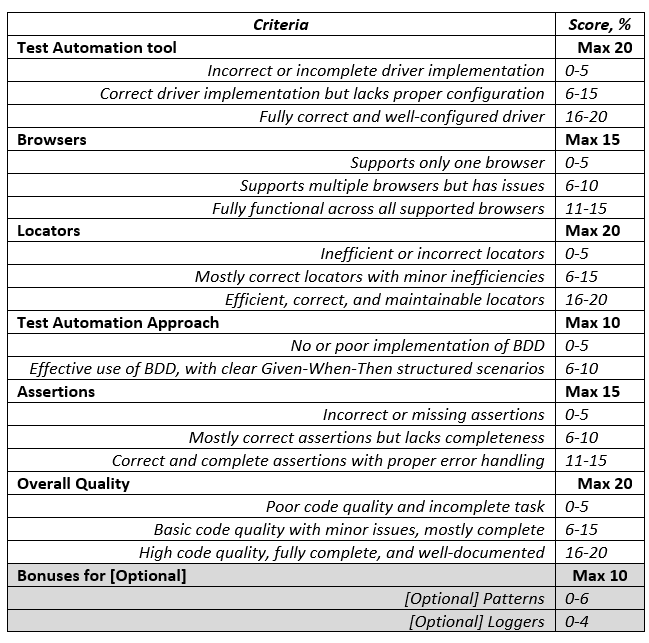
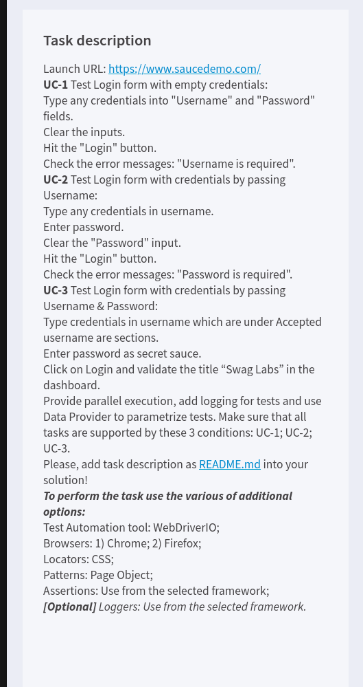

<a name="readme-top"></a>

<div align="center">
 
<br/>

<h3><b>Final Project Testing Epam</b></h3>

</div>

# 📗 Table of Contents

    - [📖 About the Project](#about-project)
    - [🛠 Built With](#built-with)
    - [Tech Stack](#tech-stack)
    - [Key Features](#key-features)
    - [💻 Getting Started](#getting-started)
    - [Prerequisites](#prerequisites)
    - [Setup](#setup)
    - [Install](#install)
    - [Run tests](#run-tests)
    - [👥 Authors](#authors)
    - [🔭 Future Features](#future-features)
    - [🤝 Contributing](#contributing)
    - [🙏 Acknowledgements](#acknowledgements)
    - [📝 License](#license)

# 📖 Testing Final Project <a name="about-project"></a>

   Testing Final project is a Fundamental Project Based in the implementation using cucumber and some alignments to the project

   the metodology of criteria the work are in the next image bellow:

<p align="center">
 
</p>
    and this is the project of the implementation:
    
<p align="center">
 
</p>

## 🛠 Built With <a name="built-with"></a>

### Tech Stack <a name="tech-stack"></a>

   <details>
   <summary>Client</summary>
   <ul>
    <li>
     <a href="https://developer.mozilla.org/en-US/docs/Web/JavaScript">JavaScript</a>
    </li>
   </ul>
   </details>

### Key Features <a name="key-features"></a>

   - **Implement Behavioral testing using [cucumbre](https://cucumber.io/)**
   - **Adding testing implementing**
   - **Implement TAF(Layers in Test Automation Frameworks) architecture**

 <p align="right">(<a href="#readme-top">back to top</a>)</p>

## 💻 Getting Started <a name="getting-started"></a>

   To get a local copy up and running, follow these steps.

### Prerequisites

   In order to run this project you need:

    ```sh
    node version latest
    ```
### Setup

Clone this repository to your desired folder:

```sh
cd my-folder
git clone git@github.com:myaccount/my-project.git
```

### Install

   Install this project with:

    ```sh
    cd my-project
    npm install
    ```

### Run tests

   To run tests, run the following command:

    ```sh
    npm test
    npm eslint
    ```

## 👥 Authors <a name="authors"></a>

   👤 **Cesar Alberto Valencia Aguilar**

   - GitHub: [@cesarvalencia1991](https://github.com/cvalencia1991)
   - Twitter: [@twitterhandle](https://twitter.com/twitterhandle)
   - LinkedIn: [LinkedIn](https://linkedin.com/in/linkedinhandle)

<p align="right">(<a href="#readme-top">back to top</a>)</p>

## 🤝 Contributing <a name="contributing"></a>

   Contributions, issues, and feature requests are welcome!

   Feel free to check the [issues page](../../issues/).

<p align="right">(<a href="#readme-top">back to top</a>)</p>

## 🙏 Acknowledgments <a name="acknowledgements"></a>

   I would like to thank to Epam Campus to bring me the oportunity to learn this topic of automated testing using javascript

<p align="right">(<a href="#readme-top">back to top</a>)</p>

## 📝 License <a name="license"></a>

   This project is [MIT](./LICENSE) licensed.

<p align="right">(<a href="#readme-top">back to top</a>)</p>
